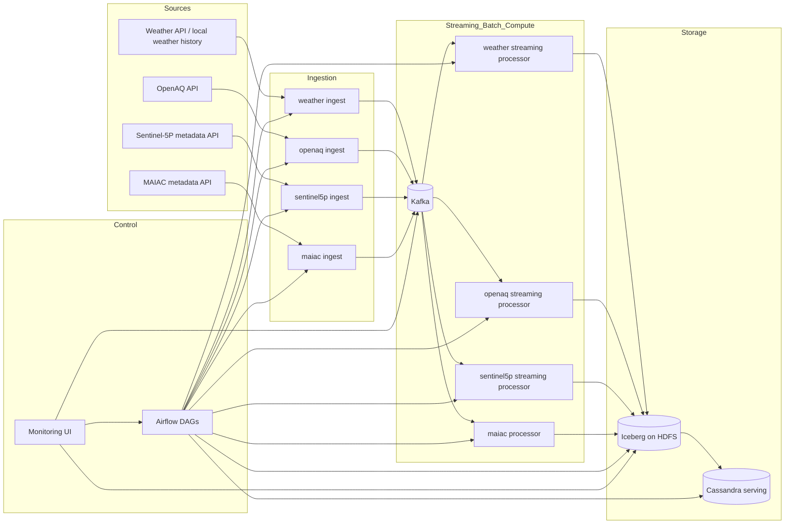
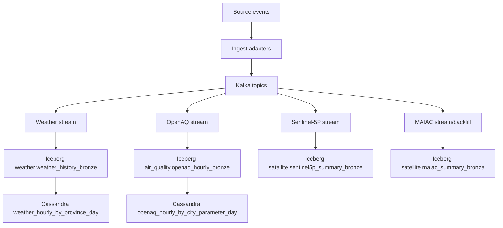
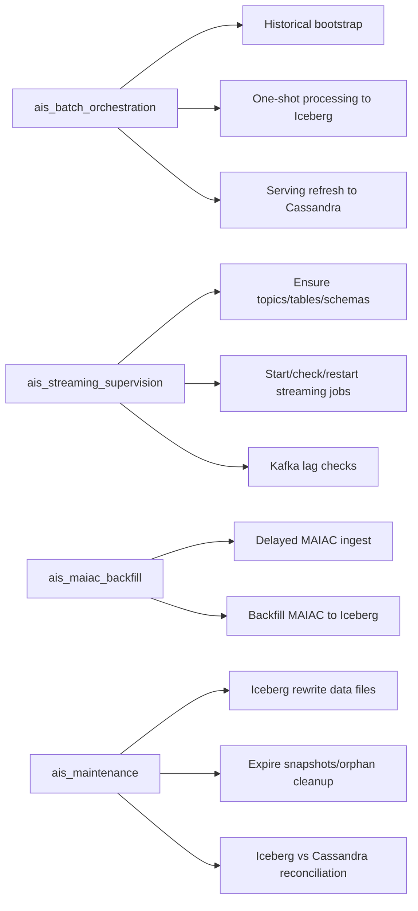

# Atmospheric Intelligence System (AIS)

Refactored architecture (April 2026):
- Iceberg is the historical source of truth.
- Cassandra is serving storage for low-latency queries.
- Realtime/near-realtime sources run as long-running Spark Structured Streaming jobs.
- Airflow is used for orchestration, supervision, backfill, and maintenance.

## 1. Refactored architecture

### 1.1 Architecture diagram



### 1.2 Data flow diagram



### 1.3 DAG responsibility diagram



## 2. Pipeline paths

### 2.1 Historical bootstrap

Implemented by DAG `ais_batch_orchestration`:
1. Ensure Kafka topics.
2. Ensure Iceberg namespaces/tables.
3. Run batch ingest for weather, openaq, sentinel5p, maiac.
4. Run one-shot Spark catchup for each source (`--stop-after-batch 1`) to persist into Iceberg.
5. Refresh weather/openaq serving tables in Cassandra.

### 2.2 Streaming supervision

Implemented by DAG `ais_streaming_supervision`:
1. Ensure topics/tables/schema.
2. Ensure long-running streaming processors are running (start if missing).
3. Check Kafka lag for stream consumer groups.

### 2.3 MAIAC delayed backfill

Implemented by DAG `ais_maiac_backfill`:
1. Pull delayed MAIAC metadata in batch windows.
2. Process to Iceberg via one-shot Spark catchup.
3. Optional serving refresh hook (currently no MAIAC Cassandra serving table is defined).

### 2.4 Maintenance and validation

Implemented by DAG `ais_maintenance`:
1. `rewrite_data_files` compact pass.
2. `expire_snapshots` and `remove_orphan_files`.
3. Reconciliation check Iceberg vs Cassandra for weather/openaq.

## 3. Key modules (refactored)

### Orchestration
- `airflow/dags/ais_pipeline_dag.py`: bootstrap/historical load DAG (kept existing DAG id).
- `airflow/dags/ais_streaming_supervision_dag.py`: stream supervision DAG.
- `airflow/dags/ais_maiac_backfill_dag.py`: MAIAC delayed backfill DAG.
- `airflow/dags/ais_maintenance_dag.py`: maintenance/reconciliation DAG.
- `airflow/dags/ais_dag_utils.py`: shared command builders used by DAGs.

### Ingestion
- `ingest/ingest_weather.py`
- `ingest/openaq_ingest.py`
- `ingest/sentinel5p_ingest.py`
- `ingest/maiac_ingest.py`
- Shared:
- `ingest/kafka_utils.py`
- `ingest/window_utils.py`

### Processing and storage
- `spark_jobs/weather_streaming.py`
- `spark_jobs/openaq_hourly_streaming.py`
- `spark_jobs/sentinel5p_summary_streaming.py`
- `spark_jobs/maiac_summary_streaming.py`
- `spark_jobs/iceberg_to_cassandra.py`
- `spark_jobs/ensure_iceberg_tables.py`
- `spark_jobs/iceberg_maintenance.py`
- `spark_jobs/reconcile_iceberg_cassandra.py`
- `spark_jobs/runtime_utils.py`

### Supervision scripts
- `scripts/airflow/ensure_stream_job.sh`
- `scripts/airflow/check_kafka_lag.sh`
- `scripts/submit_spark.sh`
- `scripts/backfill_all_sources.sh`
- `scripts/run_infrastructure_only.sh`

## 4. Local/dev runbook

### 4.1 Start infrastructure

```bash
bash scripts/run_infrastructure_only.sh
```

This script starts:
- Kafka, HDFS, Spark, Cassandra
- Iceberg table ensure job
- long-running Spark processors (detached)
- Airflow services
- monitoring UI

### 4.2 Trigger historical bootstrap

Option A (UI):
- Open `http://localhost:8501`
- Click `Start 7-Day Backfill DAG`

Option B (Airflow CLI/API):
- Trigger DAG `ais_batch_orchestration` with conf `lookback_days`.

Option C (manual script):

```bash
LOOKBACK_DAYS=7 bash scripts/backfill_all_sources.sh
```

### 4.3 Streaming operation

Streaming jobs are expected to stay long-running:
- `WeatherHistory_Streaming`
- `OpenAQHourly_Streaming`
- `Sentinel5PSummary_Streaming`
- `MAIACSummary_Streaming`

Supervision DAG `ais_streaming_supervision` ensures these jobs remain up.

### 4.4 MAIAC backfill

Use DAG `ais_maiac_backfill` (daily schedule) or trigger manually in Airflow for ad-hoc windows.

### 4.5 Maintenance

Use DAG `ais_maintenance` for compaction/snapshot expiration/reconciliation.

## 5. Monitoring

- Monitoring UI: `http://localhost:8501`
- Airflow UI: `http://localhost:8088`
- Spark master UI: `http://localhost:8080`
- HDFS UI: `http://localhost:9870`

Monitoring now checks persisted data under Iceberg warehouse path by default.

## 6. Migration notes

### 6.1 Major changes
- Sentinel-5P and MAIAC processors now persist to Iceberg tables (not only parquet path sinks).
- Weather/OpenAQ processors now run long-running by default and support bootstrap mode via `--stop-after-batch 1`.
- Airflow orchestration split by responsibility into bootstrap, supervision, backfill, maintenance DAGs.
- Added lag checks and stream auto-start checks for supervision.
- Added Iceberg maintenance and Iceberg-vs-Cassandra reconciliation jobs.

### 6.2 Backward compatibility
- Existing DAG id `ais_batch_orchestration` is preserved.
- Existing ingest modules and Kafka topic names are preserved.
- Existing serving tables in Cassandra for weather/openaq are preserved.

### 6.3 Operational cautions
- Cassandra remains serving storage, not historical source.
- If Kafka consumer groups are still warming up, lag checks may return warnings until first commits.
- MAIAC Cassandra serving table is intentionally not introduced yet; MAIAC is persisted in Iceberg and can be projected later if required.
# Atmospheric Intelligence System (AIS)

Pipeline Big Data cho dữ liệu khí quyển: WeatherAPI history, OpenAQ hourly, Sentinel-5P và MAIAC. Kiến trúc vận hành chuẩn: Python ingest adapters -> Kafka -> Spark (realtime/batch) -> Iceberg/HDFS -> Cassandra, với Airflow chỉ giữ vai trò batch orchestration.

## Mục lục

1. [Kiến trúc tổng thể](#1-kiến-trúc-tổng-thể)
2. [Cấu trúc thư mục](#2-cấu-trúc-thư-mục)
3. [Docker Compose](#3-docker-compose)
4. [Ingest services](#4-ingest-services)
5. [Spark và storage](#5-spark-và-storage)
6. [Hướng dẫn chạy](#6-hướng-dẫn-chạy)
7. [Kiểm tra kết quả](#7-kiểm-tra-kết-quả)
8. [Lưu ý thiết kế cho Kubernetes](#8-lưu-ý-thiết-kế-cho-kubernetes)

## Tài liệu dataset liên quan

- Xem `README_DATASETS.md` để biết chi tiết schema, định dạng và cách khai thác OpenAQ, WeatherAPI, Sentinel-5P (NetCDF) và Mosaic MAIAC (HDF4).

---

## 1. Kiến trúc tổng thể

### Pipeline Flow

```text
Weather JSON/API ─┐
OpenAQ CSV/API  ──┼──> Python Ingest ──> Kafka ──> Spark Structured Streaming ──> Iceberg/HDFS
Sentinel-5P API ──┘                               │
                                                   └──> Spark batch load ──> Cassandra

Airflow điều phối các bước batch ingest và batch load serving (khong chay long-running realtime jobs).
Monitoring UI đọc Kafka/HDFS để theo dõi throughput và trạng thái lưu trữ.
```

### Vai trò từng service

| Service | Vai trò |
|---------|---------|
| `zookeeper` | Quản lý cluster metadata cho Kafka |
| `kafka` | Message broker nhận events từ ingest và cung cấp cho Spark |
| `namenode`, `datanode` | HDFS storage cho warehouse Iceberg và checkpoint |
| `spark-master`, `spark-worker` | Chạy Spark Structured Streaming và batch jobs |
| `ingest`, `openaq-ingest`, `sentinel5p-ingest`, `maiac-ingest` | Python source adapters đẩy dữ liệu về Kafka |
| `cassandra` | Serving layer cho truy vấn latency thấp |
| `airflow-*` | Airflow metadata DB, webserver, scheduler, triggerer và DAG orchestration |
| `monitoring-ui` | Dashboard theo dõi Kafka, HDFS/DataNode và pipeline status |

---

## 2. Cấu trúc thư mục

```text
Atmospheric_intelligence_sys---AIS/
├── docker-compose.yml              # Orchestration local cho Kafka, HDFS, Spark, Cassandra, Airflow, monitoring
├── airflow/
│   ├── Dockerfile
│   └── dags/
│       └── ais_pipeline_dag.py     # DAG batch orchestration cho ingest + load Cassandra
├── ingest/
│   ├── Dockerfile
│   ├── requirements.txt
│   ├── ingest_weather.py           # Weather history producer
│   ├── openaq_ingest.py            # OpenAQ hourly producer
│   ├── sentinel5p_ingest.py        # Sentinel-5P summary producer
│   └── maiac_ingest.py             # MAIAC metadata producer
├── spark_jobs/
│   ├── weather_streaming.py        # Kafka weather_history -> Iceberg
│   ├── openaq_hourly_streaming.py  # Kafka openaq-hourly -> Iceberg
│   ├── sentinel5p_summary_streaming.py # Kafka sentinel5p-summary -> HDFS parquet
│   ├── maiac_summary_streaming.py  # Kafka maiac-summary -> HDFS parquet
│   └── iceberg_to_cassandra.py     # Iceberg -> Cassandra serving tables
├── data/
│   ├── weather/                    # Weather history JSON theo tỉnh/thành
│   └── crawling/                   # Script crawl WeatherAPI, OpenAQ, Sentinel-5P
├── crawler/                        # GeoJSON, notebook và dữ liệu MODIS MAIAC
├── monitoring/                     # Monitoring UI
├── scripts/                        # Helper scripts tạo topic, submit Spark, health check
├── hadoop/
│   └── hadoop.env                  # Cấu hình Hadoop/HDFS
└── checkpoints/                    # Runtime state/checkpoint
```

---

## 3. Docker Compose

File `docker-compose.yml` chạy các service trên network chung `bigdata-net`.

**Các cổng chính:**

| Port | Service | Mô tả |
|------|---------|-------|
| 2181 | Zookeeper | Client connections |
| 9092 / 29092 | Kafka | Internal / external listeners |
| 9870 | HDFS Namenode | Web UI |
| 9864 | HDFS Datanode | Web UI |
| 8080 | Spark Master | Web UI |
| 7077 | Spark Master | RPC |
| 8088 | Airflow Webserver | Airflow UI |
| 9042 | Cassandra | CQL |
| 8501 | Monitoring UI | Pipeline dashboard |

**Persistent volumes:**

- `namenode_data`, `datanode_data`: HDFS data
- `cassandra_data`: Cassandra data
- `airflow_postgres_data`: Airflow metadata database

NiFi khong con nam trong runtime path chinh. Folder `nifi/` duoc giu lai cho future work.

---

## 4. Ingest services

### Weather history

- File: `ingest/ingest_weather.py`
- Kafka topic mặc định: `weather_history`
- Input:
  - Local JSON trong `./data/weather/<province>/<date>.json`, hoặc
  - WeatherAPI history khi cấu hình mode/API key phù hợp
- Output: mỗi bản ghi theo giờ là một JSON event gồm `event_id`, `province`, `query_date`, `event_time`, nhiệt độ, độ ẩm, gió, mưa, điều kiện thời tiết, tọa độ và metadata ingest.

### OpenAQ hourly

- File: `ingest/openaq_ingest.py`
- Kafka topic mặc định: `openaq-hourly`
- Input mặc định trong container: `/data/crawling/openaq_vietnam_hourly.csv`
- Output: mỗi dòng hourly measurement thành một JSON event gồm location, sensor, parameter, unit, value, min/max/sd, coverage và metadata ingest.

### Sentinel-5P summary

- File: `ingest/sentinel5p_ingest.py`
- Service Compose: `sentinel5p-ingest`
- Kafka topic mặc định: `sentinel5p-summary`
- Input: CDSE credentials từ biến môi trường `CDSE_USERNAME`, `CDSE_PASSWORD`
- Output: summary statistics cho các product `NO2`, `CO`, `O3`, `SO2`, `CH4`, `AER` trong bbox cấu hình.

---

## 5. Spark và storage

### Streaming jobs

| Job | Kafka topic | Iceberg table | Checkpoint |
|-----|-------------|---------------|------------|
| `weather_streaming.py` | `weather_history` | `ais.weather.weather_history_bronze` | `hdfs://namenode:9000/checkpoints/weather_history/` |
| `openaq_hourly_streaming.py` | `openaq-hourly` | `ais.air_quality.openaq_hourly_bronze` | `hdfs://namenode:9000/checkpoints/openaq_hourly/` |

Summary streaming jobs (realtime path):

| Job | Kafka topic | Sink |
|-----|-------------|------|
| `sentinel5p_summary_streaming.py` | `sentinel5p-summary` | `hdfs://namenode:9000/data/sentinel5p_summary/` |
| `maiac_summary_streaming.py` | `maiac-summary` | `hdfs://namenode:9000/data/maiac_summary/` |

Iceberg warehouse:

```text
hdfs://namenode:9000/warehouse/iceberg
```

### Cassandra serving

`spark_jobs/iceberg_to_cassandra.py` đọc từ Iceberg và ghi sang keyspace `ais_serving`:

- `weather_hourly_by_province_day`
- `openaq_hourly_by_city_parameter_day`

---

## 6. Hướng dẫn chạy

### Yêu cầu

- Docker Desktop hoặc Docker Engine
- Docker Compose v2
- Tối thiểu 8 GB RAM cho Docker
- Tối thiểu 10 GB disk trống

### 1. Khởi động infrastructure

```bash
docker-compose up -d zookeeper kafka namenode datanode spark-master spark-worker cassandra
docker-compose ps
```

UI hữu ích:

- HDFS Namenode: http://localhost:9870
- Spark Master: http://localhost:8080
- Cassandra: `localhost:9042`

### 2. Tạo Kafka topics

```bash
docker exec kafka kafka-topics --create --bootstrap-server kafka:9092 --replication-factor 1 --partitions 3 --topic weather_history --if-not-exists
docker exec kafka kafka-topics --create --bootstrap-server kafka:9092 --replication-factor 1 --partitions 3 --topic openaq-hourly --if-not-exists
docker exec kafka kafka-topics --create --bootstrap-server kafka:9092 --replication-factor 1 --partitions 3 --topic sentinel5p-summary --if-not-exists
docker exec kafka kafka-topics --create --bootstrap-server kafka:9092 --replication-factor 1 --partitions 3 --topic maiac-summary --if-not-exists
docker exec kafka kafka-topics --list --bootstrap-server kafka:9092
```

### 3. Tạo HDFS paths

```bash
docker exec namenode hdfs dfs -mkdir -p /warehouse/iceberg
docker exec namenode hdfs dfs -mkdir -p /checkpoints/weather_history
docker exec namenode hdfs dfs -mkdir -p /checkpoints/openaq_hourly
docker exec namenode hdfs dfs -chmod -R 777 /warehouse
docker exec namenode hdfs dfs -chmod -R 777 /checkpoints
```

### 4. Chạy ingest

```bash
docker compose build ingest openaq-ingest sentinel5p-ingest maiac-ingest
docker compose run --rm -e WINDOW_MODE=batch -e BATCH_LOOKBACK_DAYS=7 ingest
docker compose run --rm -e WINDOW_MODE=batch -e BATCH_LOOKBACK_DAYS=7 openaq-ingest
```

Sentinel-5P va MAIAC co the chay rieng:

```bash
docker compose run --rm -e WINDOW_MODE=batch -e BATCH_LOOKBACK_DAYS=7 sentinel5p-ingest
docker compose run --rm -e WINDOW_MODE=batch -e BATCH_LOOKBACK_DAYS=30 maiac-ingest
```

### 5. Submit Spark jobs

```bash
bash scripts/submit_spark.sh weather
bash scripts/submit_spark.sh openaq
bash scripts/submit_spark.sh sentinel5p
bash scripts/submit_spark.sh maiac
```

Sau khi có dữ liệu trong Iceberg, load sang Cassandra:

```bash
bash scripts/submit_spark.sh cassandra-weather
bash scripts/submit_spark.sh cassandra-openaq
```

### 6. Chạy Airflow orchestration

```bash
docker compose up --build airflow-init
docker compose up -d airflow-webserver airflow-scheduler airflow-triggerer
```

Airflow UI: http://localhost:8088

Đăng nhập mặc định:

- Username: `admin`
- Password: `admin`

DAG chính: `ais_batch_orchestration`

### 7. Mở Monitoring UI

```bash
docker-compose up -d --build monitoring-ui
```

Monitoring UI: http://localhost:8501

---

## 7. Kiểm tra kết quả

### Kafka

```bash
docker exec kafka kafka-run-class kafka.tools.GetOffsetShell --broker-list kafka:9092 --topic weather_history --time -1
docker exec kafka kafka-run-class kafka.tools.GetOffsetShell --broker-list kafka:9092 --topic openaq-hourly --time -1
docker exec kafka kafka-run-class kafka.tools.GetOffsetShell --broker-list kafka:9092 --topic sentinel5p-summary --time -1
docker exec kafka kafka-run-class kafka.tools.GetOffsetShell --broker-list kafka:9092 --topic maiac-summary --time -1

docker exec kafka kafka-console-consumer --bootstrap-server kafka:9092 --topic weather_history --from-beginning --max-messages 5
docker exec kafka kafka-console-consumer --bootstrap-server kafka:9092 --topic openaq-hourly --from-beginning --max-messages 5
```

### Spark

```bash
docker logs spark-master -f --tail 50
```

Mở Spark UI tại http://localhost:8080 và kiểm tra các application:

- `WeatherHistory_Streaming`
- `OpenAQHourly_Streaming`
- `Sentinel5PSummary_Streaming`
- `MAIACSummary_Streaming`
- `IcebergToCassandra_Weather`
- `IcebergToCassandra_OpenAQ`

### HDFS / Iceberg

```bash
docker exec namenode hdfs dfs -ls -R /warehouse/iceberg
docker exec namenode hdfs dfs -ls -R /checkpoints/weather_history
docker exec namenode hdfs dfs -ls -R /checkpoints/openaq_hourly
```

Mở HDFS Web UI: http://localhost:9870 -> Utilities -> Browse the file system -> `/warehouse/iceberg`.

### Cassandra

---

## 8. Lưu ý thiết kế cho Kubernetes

TODO3 đặt Kubernetes làm runtime đích cho compute, không migrate storage/stateful data trong pha này.

- Giữ Kafka/Zookeeper, HDFS/Iceberg warehouse, Cassandra và Airflow metadata DB ở tầng storage/data infrastructure bên ngoài Kubernetes.
- Docker Compose Spark master/worker chỉ là fallback local/dev; Spark driver/executor pods trên Kubernetes mới là target runtime của TODO3.
- Airflow tiếp tục là control plane để schedule/backfill/rerun, còn Kubernetes thực thi Spark batch, HYSPLIT/trajectory, ML training, ML inference, API và check jobs.
- Config runtime đi qua environment variables, ConfigMap hoặc Secret; không hardcode hostname Compose trong code path chạy trên Kubernetes.
- Pod Kubernetes phải dùng endpoint được override qua `KAFKA_BOOTSTRAP_SERVERS`, `HDFS_NAMENODE`, `HDFS_WEBHDFS_BASE`, `ICEBERG_WAREHOUSE`, `CASSANDRA_HOST` khi cần.

Luồng dữ liệu đích của TODO3:

```text
External sources
-> ingest producers
-> Kafka/HDFS/Iceberg storage layer
-> Spark jobs on Kubernetes
-> Iceberg Bronze/Silver/Gold
-> Hanoi PM2.5 master hourly gold
-> PM2.5 serving features gold
-> ML inference Job/CronJob on Kubernetes
-> PM2.5 prediction table
-> PM2.5 API Deployment on Kubernetes
-> dashboard/user
```

Request-time API chỉ đọc prediction đã materialize và trả JSON. API không submit Spark, không chạy HYSPLIT, không build feature, không train model và không chạy inference trong handler.

---

## Dọn dẹp

```bash
docker-compose down
docker-compose down -v
docker-compose down --rmi local
```
