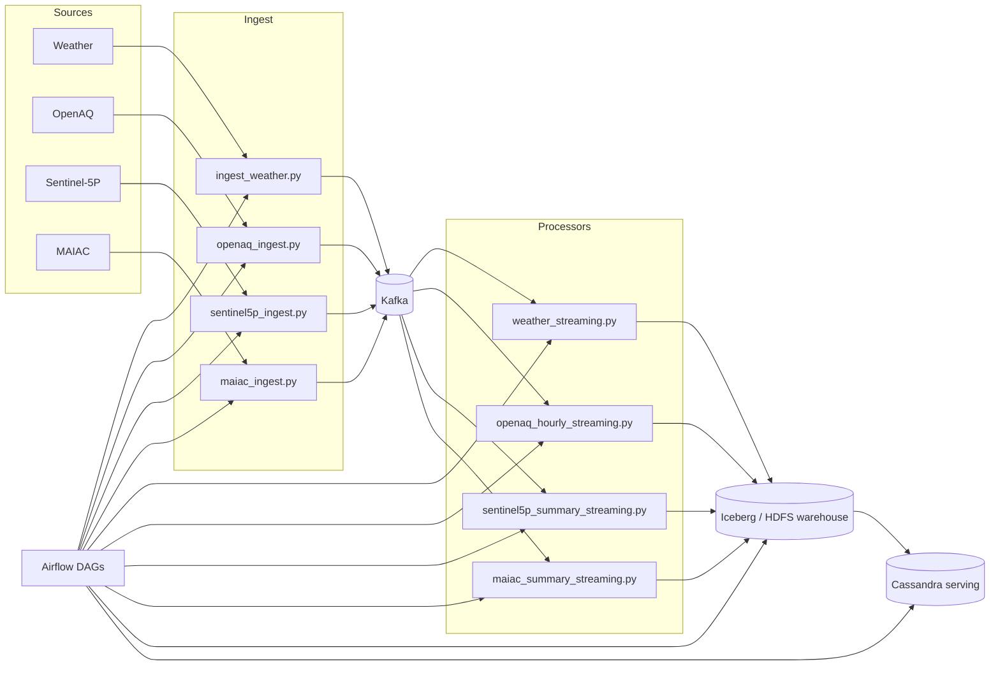
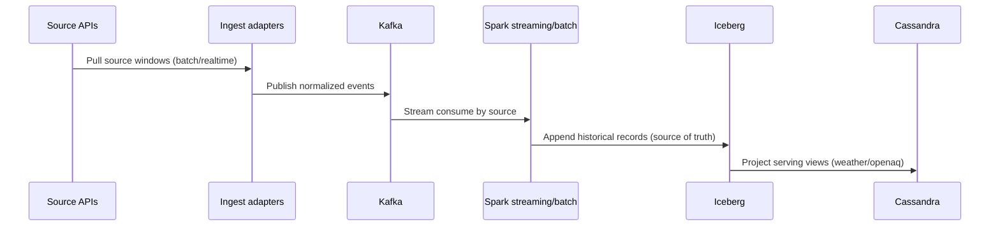
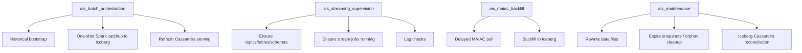

# AIS Refactored Architecture

This document captures the post-refactor target operating model.

## Architecture

```mermaid
flowchart LR
  subgraph Sources
    W[Weather]
    O[OpenAQ]
    S[Sentinel-5P]
    M[MAIAC]
  end

  subgraph Ingest
    IW[ingest_weather.py]
    IO[openaq_ingest.py]
    IS[sentinel5p_ingest.py]
    IM[maiac_ingest.py]
  end

  K[(Kafka)]

  subgraph Processors
    SW[weather_streaming.py]
    SO[openaq_hourly_streaming.py]
    SS[sentinel5p_summary_streaming.py]
    SM[maiac_summary_streaming.py]
  end

  I[(Iceberg / HDFS warehouse)]
  C[(Cassandra serving)]
  A[Airflow DAGs]

  W --> IW --> K
  O --> IO --> K
  S --> IS --> K
  M --> IM --> K

  K --> SW --> I
  K --> SO --> I
  K --> SS --> I
  K --> SM --> I

  I --> C

  A --> IW
  A --> IO
  A --> IS
  A --> IM
  A --> SW
  A --> SO
  A --> SS
  A --> SM
  A --> I
  A --> C
```

## Data flow

```mermaid
sequenceDiagram
  participant SRC as Source APIs
  participant ING as Ingest adapters
  participant K as Kafka
  participant SP as Spark streaming/batch
  participant ICE as Iceberg
  participant CAS as Cassandra

  SRC->>ING: Pull source windows (batch/realtime)
  ING->>K: Publish normalized events
  K->>SP: Stream consume by source
  SP->>ICE: Append historical records (source of truth)
  ICE->>CAS: Project serving views (weather/openaq)
```

## DAG responsibilities

```mermaid
flowchart TD
  A[ais_batch_orchestration] --> A1[Historical bootstrap]
  A --> A2[One-shot Spark catchup to Iceberg]
  A --> A3[Refresh Cassandra serving]

  B[ais_streaming_supervision] --> B1[Ensure topics/tables/schemas]
  B --> B2[Ensure stream jobs running]
  B --> B3[Lag checks]

  C[ais_maiac_backfill] --> C1[Delayed MAIAC pull]
  C --> C2[Backfill to Iceberg]

  D[ais_maintenance] --> D1[Rewrite data files]
  D --> D2[Expire snapshots / orphan cleanup]
  D --> D3[Iceberg-Cassandra reconciliation]
```
